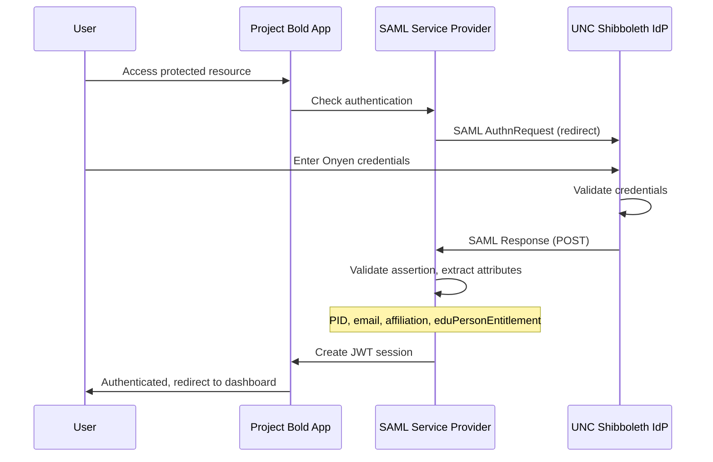
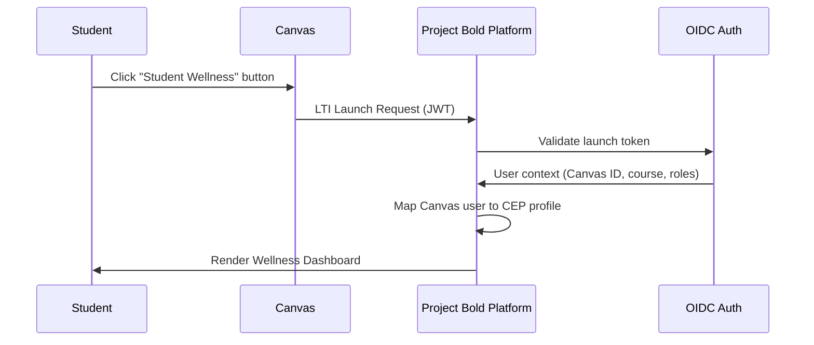
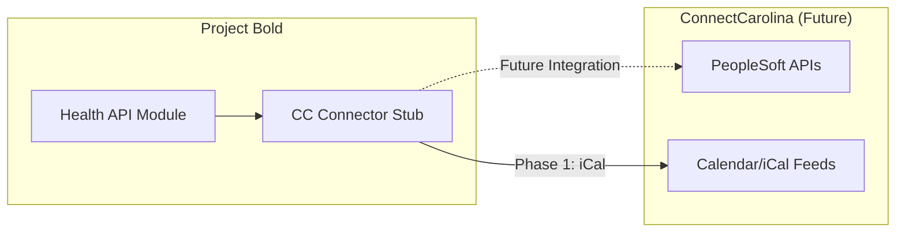
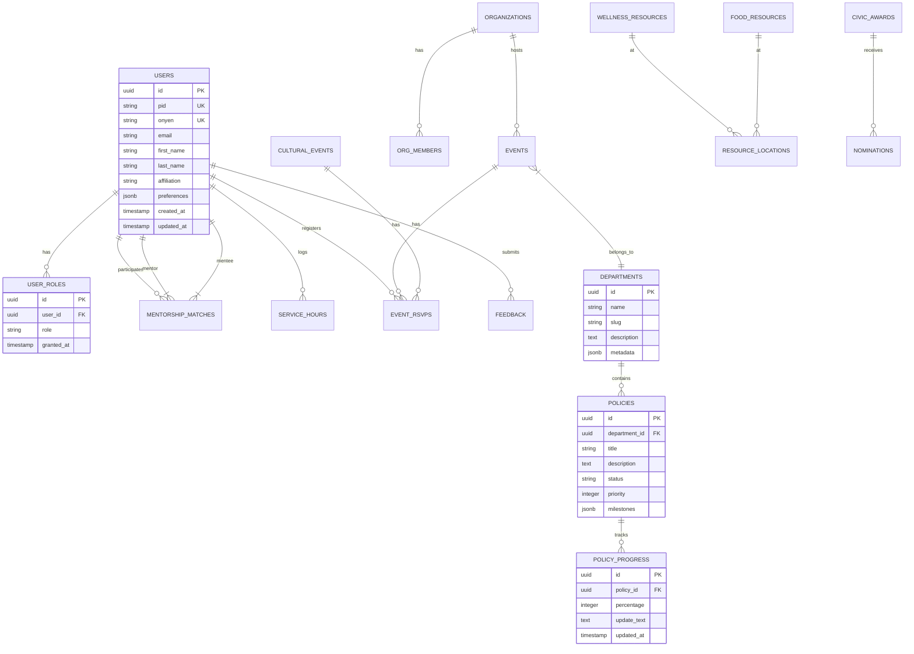

# Project Bold Policy Platform (CEP) - Architecture Documentation

## Vision: First, Best, For All

A unified, mobile-first, UNC-native digital hub implementing Devin Duncan's 2026-2027 Student Body President policy vision.

---

## System Architecture Overview

```mermaid
flowchart TB
    subgraph "Client Layer"
        WEB[Next.js Web App<br/>Mobile-First PWA]
        MOBILE[React Native App<br/>iOS/Android]
    end

    subgraph "API Gateway"
        GW[API Gateway<br/>Rate Limiting, Auth Validation]
    end

    subgraph "Authentication Layer"
        SAML[SAML 2.0 SP<br/>UNC Shibboleth]
        JWT[JWT Session Manager]
        MOCK[Mock Auth<br/>Development Mode]
    end

    subgraph "Core Services"
        USER[User Service<br/>Profiles, Roles]
        DASH[Dashboard Service<br/>Unified Hub]
        EVENT[Event Service<br/>RSVP, Calendar]
        NOTIFY[Notification Service<br/>Email, Push]
    end

    subgraph "Department Microservices"
        ACAD[Academic Affairs<br/>Peer Mentorship, Advising]
        BASIC[Basic Needs<br/>Food Security, Housing]
        CIVIC[Civic Engagement<br/>Service Hours, Awards]
        DEI[DEI Service<br/>Cultural Calendar, Council]
        WELL[Wellness & Safety<br/>CAPS, Resources]
        ENV[Environmental Affairs<br/>Sustain Week, Composting]
        STATE[State & External<br/>Alumni Network, Advocacy]
        COMM[Communications<br/>Stories, Podcast, Social]
    end

    subgraph "AI Services"
        MATCH[AI Matching Engine<br/>Peer Mentorship]
        ALERT[Early Alert System<br/>Academic Support]
        REC[Recommendation Engine<br/>Personalization]
    end

    subgraph "UNC Integrations"
        CANVAS[Canvas LTI 1.3<br/>Wellness Button]
        CC[ConnectCarolina<br/>Health Scheduling]
        IDP[UNC IdP<br/>Shibboleth]
    end

    subgraph "Data Layer"
        PG[(PostgreSQL<br/>Primary Database)]
        REDIS[(Redis<br/>Sessions/Cache)]
        S3[(Object Storage<br/>Media/Documents)]
    end

    subgraph "Observability"
        LOG[Logging Service]
        METRICS[Metrics/Analytics]
        AUDIT[Audit Trail]
    end

    WEB --> GW
    MOBILE --> GW
    GW --> SAML
    GW --> JWT
    SAML --> IDP
    SAML --> MOCK

    GW --> USER
    GW --> DASH
    GW --> EVENT
    GW --> NOTIFY

    DASH --> ACAD
    DASH --> BASIC
    DASH --> CIVIC
    DASH --> DEI
    DASH --> WELL
    DASH --> ENV
    DASH --> STATE
    DASH --> COMM

    ACAD --> MATCH
    ACAD --> ALERT
    DASH --> REC

    WELL --> CANVAS
    WELL --> CC

    USER --> PG
    EVENT --> PG
    ACAD --> PG
    BASIC --> PG
    CIVIC --> PG
    DEI --> PG
    WELL --> PG
    ENV --> PG
    STATE --> PG
    COMM --> PG

    JWT --> REDIS
    GW --> LOG
    GW --> METRICS
    GW --> AUDIT
```



---

## Tech Stack Rationale

### Frontend
| Technology | Purpose | Justification |
|------------|---------|---------------|
| **Next.js 14+** | Web Framework | SSR/SSG for SEO, App Router, built-in API routes, excellent DX |
| **React 18** | UI Library | Component-based, large ecosystem, UNC dev familiarity |
| **TypeScript** | Type Safety | Catch errors early, better maintainability |
| **Tailwind CSS** | Styling | Mobile-first utilities, consistent design, rapid development |
| **PWA** | Mobile Web | Offline support, push notifications, installable |

### Backend
| Technology | Purpose | Justification |
|------------|---------|---------------|
| **Node.js/Express** | API Server | JavaScript ecosystem, async I/O, wide library support |
| **TypeScript** | Type Safety | Shared types with frontend, better API contracts |
| **PostgreSQL** | Primary DB | ACID compliance, JSON support, UNC IT familiarity |
| **Redis** | Caching/Sessions | Fast session storage, pub/sub for real-time features |
| **passport-saml** | SAML Auth | Mature library for Shibboleth integration |

### AI/ML
| Technology | Purpose | Justification |
|------------|---------|---------------|
| **OpenAI/Anthropic API** | AI Features | Peer matching, recommendations, content generation |
| **Vector DB (future)** | Embeddings | Semantic search for resources, mentorship matching |

### Infrastructure (Carolina CloudApps Compatible)
| Technology | Purpose | Justification |
|------------|---------|---------------|
| **Docker** | Containerization | Consistent environments, CloudApps deployment |
| **Kubernetes/OpenShift** | Orchestration | Carolina CloudApps native support |
| **GitHub Actions** | CI/CD | Automated testing, deployment pipelines |

---

## Department Module Mapping

Based on Project Bold Policy Book, each department maps to a microservice:

### 1. Academic Affairs Service
**Policies Implemented:**
- P1: University-Wide Peer Mentorship Network (AI-powered matching)
- P2: Midterm Progress Check-Ins (Canvas integration)
- P3: STEM Collaboration Centers (booking system)
- P4: Dean's List Enhancement (notification system)
- P5: First-Year Strengths Integration (Gallup assessment tracker)

### 2. Basic Needs Service
**Policies Implemented:**
- P1: Farmers Markets & Chase Farm Stands (location/schedule)
- P2: Centralized Food Security Hub (resource mapping)
- P3: Plus Swipe Expansion (vendor directory)
- P4: Grocery Transportation (shuttle scheduling)
- P5: Off-Campus Living Education (workshops, CFWC integration)

### 3. Civic Engagement Service
**Policies Implemented:**
- P1: Carolina Civic Award (nominations, voting)
- P2: Town-University Partnership Council (opportunities board)
- P3: Carolina Day of Service (volunteer signup)
- P4: Centralized Service Initiative (hour tracking, SG requirements)
- P5: Nonpartisan Newsletter (subscription, content)

### 4. DEI Service
**Policies Implemented:**
- P1: Student Success Syllabi Section (template generator)
- P2: Cultural Organizations Council (directory, collaboration tools)
- P3: University-Wide Cultural Calendar (events aggregation)
- P4: Cultural Programming Fund (applications, tracking)

### 5. Student Wellness & Safety Service
**Policies Implemented:**
- P1: CAPS Access Expansion (appointment integration)
- P2: Off-Campus Safety Task Force (SafeWalk, ride programs)
- P3: Plan B/Narcan Distribution (location mapping)
- P4: Event Safety Planning (checklist, submissions)
- P5: Canvas "Student Wellness" Button (LTI integration)
- P6: ConnectCarolina Health Integration

### 6. Environmental Affairs Service
**Policies Implemented:**
- P1: Sustain Carolina Week (event coordination)
- P2: Too Good To Go Pilot (surplus meal system)
- P3: Adopt-a-Space (organization assignments, cleanup days)
- P4: Composting Expansion (station mapping, metrics)
- P5: Move-Out Donation Shop (inventory, scheduling)

### 7. State & External Affairs Service
**Policies Implemented:**
- P1: Heels on the Hill (lobby day registration, training)
- P2: Legislators-in-Residence Day (scheduling, RSVPs)
- P3: Alumni in Public Service Network (directory, mentorship matching)
- P4: Nonpartisan Roundtables (event series)

### 8. Communications Service
**Initiatives Implemented:**
- I1: "Who is Carolina" Campaign (story submissions, video library)
- I2: Student Advisory Committee (applications, meetings)
- I3: Student Government Podcast (episodes, guests)
- I4: Arts/Dance/Theater Spotlights (submissions, social integration)
- I5: Student Success Social Media (achievements feed)
- I6: Accountability Dashboard (metrics, progress tracking)

---

## UNC IT Integration Architecture

### Phase 1: Shibboleth/SAML SSO



**Implementation Details:**
- Library: `passport-saml` with Express middleware
- Metadata exchange with UNC ITS
- ACS URL: `https://projectbold.unc.edu/auth/saml/callback`
- Attribute mapping: PID → userId, eduPersonAffiliation → role

### Phase 2: Canvas LTI 1.3 Integration



**Implementation Details:**
- LTI Advantage (Deep Linking, Assignment & Grades)
- Developer key via UNC EdTech approval
- Placement: Global Navigation or Course Navigation
- REST API integration for announcements sync

### Phase 3: ConnectCarolina Stub



**Notes:**
- PeopleSoft access requires ITS partnership
- Start with read-only iCal feeds if available
- Escalate through Student Government channels

---

## Security & Compliance

### FERPA Compliance
- Student data encrypted at rest (AES-256)
- Role-based access control (RBAC)
- Data minimization principles
- Audit logging for all data access

### HIPAA Considerations (Wellness Data)
- Separate database schema for health-related data
- Additional encryption layers
- No PHI stored without explicit consent
- CAPS/health scheduling via redirect, not data sync

### WCAG 2.1 AA Accessibility
- Semantic HTML throughout
- ARIA labels for interactive elements
- Color contrast compliance
- Keyboard navigation support
- Screen reader testing

### Security Measures
- HTTPS enforced (TLS 1.3)
- JWT token rotation (15min access, 7d refresh)
- CSRF protection
- Input sanitization
- SQL injection prevention (parameterized queries)
- Rate limiting (100 req/min default)

---

## Database Schema Overview



---

## MVP Scope (Phase 1)

### Included in MVP:
1. **Authentication**: SAML SSO (mock mode for dev)
2. **Core Dashboard**: Role-based unified hub
3. **Student Wellness Module**: Canvas LTI button, resource directory
4. **Academic Affairs**: Peer mentorship matching (AI-powered)
5. **Transparency Dashboard**: Public policy progress metrics
6. **Event System**: Basic RSVP functionality

### Deferred to Phase 2:
- Full Canvas LTI integration (requires EdTech approval)
- ConnectCarolina health scheduling
- Mobile native apps (PWA first)
- AI early alert system
- All remaining department modules

---

## Deployment Strategy

### Development
```bash
docker-compose up  # Local development
# Mock SAML enabled, local PostgreSQL
```

### Staging (Carolina CloudApps)
- OpenShift deployment
- UNC VPN-restricted access
- Test SAML integration with ITS

### Production
- Full Shibboleth integration
- PostgreSQL managed instance
- Redis cluster for sessions
- CDN for static assets

---

## Values Alignment

Every feature maps to Project Bold values:

| Value | Platform Implementation |
|-------|------------------------|
| **Courage** | Bold transparency dashboard, public accountability metrics |
| **Community** | Peer mentorship, cultural calendar, service coordination |
| **Accountability** | Progress tracking, follow-through metrics, audit logs |
| **Equity** | Accessible design, food security hub, resource mapping |
| **Innovation** | AI matching, Canvas integration, mobile-first PWA |

---

## Next Steps

1. **Immediate**: Project structure setup, backend foundation
2. **Week 1**: Auth module, database schemas, basic API
3. **Week 2**: Frontend scaffold, dashboard, wellness module
4. **Week 3**: Academic affairs service, AI matching
5. **Week 4**: Transparency dashboard, testing, documentation

---

*Project Bold: Building a Carolina that is First, Best, and For All.*
